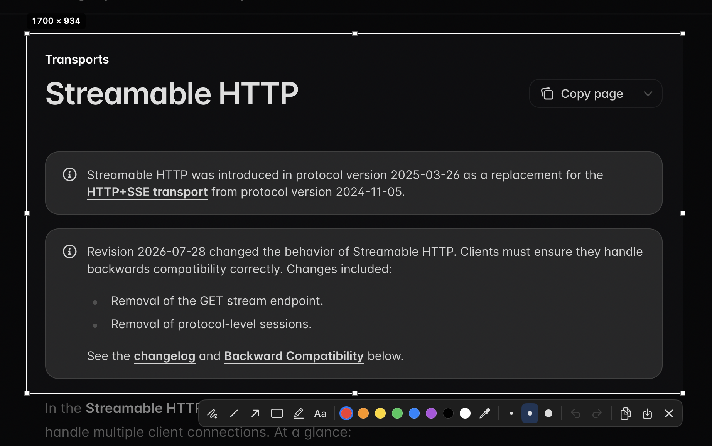

# Screeny

A fast, free and open-source screenshot tool for macOS, modeled on [Lightshot](https://app.prntscr.com/)'s workflow.

Press a hotkey, drag over part of the screen, scribble an arrow or a note on it, and copy it to the clipboard, all in a couple of seconds. No accounts, no cloud, no telemetry.



## What it's for

Screeny is for quick annotated screenshots you paste somewhere right away: a bug report, a chat message, a doc, a code review. The built-in macOS tools can capture a region, but marking it up means opening another window first. In Screeny you draw right on the frozen screen, then copy or save.

## How it works

1. Press **⇧⌘S** (Shift + Command + S), or choose **Capture Region** from the menu bar icon.
2. The screen freezes under a dimmed overlay.
3. Drag to select a region. The size is shown in pixels, and you can move or resize the selection afterwards.
4. A toolbar appears next to the selection. Pick a tool and draw on the screenshot.
5. Press **⌘C** to copy to the clipboard or **⌘S** to save a PNG. **Esc** cancels at any point.

## Features

- Lives in the menu bar, with no Dock icon.
- Global hotkey, changeable or removable in Settings.
- Works across all connected displays, including Retina and mixed-resolution setups.
- Exports at full native resolution.
- Annotation tools:
  - **Pen:** freehand drawing
  - **Line** and **Arrow:** hold Shift to snap to 45°
  - **Rectangle:** hold Shift for a square
  - **Marker:** translucent highlighter
  - **Text:** click to type, Enter to place
- 8 preset colors plus a custom color picker, and three stroke widths. The width also sets the text size.
- Undo and redo.
- Settings: hotkey, default save folder, file name pattern, launch at login.

### Keyboard shortcuts

| Shortcut | Action |
| --- | --- |
| ⇧⌘S | Start a capture (global, configurable) |
| ⌘C | Copy selection to clipboard |
| ⌘S | Save selection as PNG |
| ⌘Z / ⇧⌘Z | Undo / redo |
| Esc | Cancel |
| Shift while drawing | Snap lines to 45°, make rectangles square |

With no tool selected, dragging inside the selection moves it. Click the active tool again to go back to that mode.

## Requirements

- macOS 14 (Sonoma) or later
- **Screen Recording** permission. On first capture, Screeny explains why and opens the right pane in System Settings. You may need to reopen the app after granting it.

## Building and installing

Screeny is built from source. You need Xcode and [XcodeGen](https://github.com/yonaskolb/XcodeGen):

```bash
brew install xcodegen
git clone git@github.com:fikretkurtiiev/screeny.git
cd screeny
xcodegen generate
open Screeny.xcodeproj        # then ⌘R to run
```

To install a Release build into `/Applications`:

```bash
xcodebuild -scheme Screeny -configuration Release -destination 'platform=macOS' -derivedDataPath build clean build
rm -rf /Applications/Screeny.app
cp -R build/Build/Products/Release/Screeny.app /Applications/
open /Applications/Screeny.app
```

Local builds are signed ad hoc, so macOS may ask for Screen Recording permission again after you install a new build. To avoid that, set a stable signing identity in `Config/Local.xcconfig`. That file isn't committed.

### Saved file names

Files are named from a pattern you can edit in Settings. Text inside `{braces}` is a date format; everything else is kept as written. The default is:

```
Screeny {yyyy-MM-dd} at {HH.mm.ss}   →   Screeny 2026-09-21 at 14.05.09.png
```

## Privacy

Screeny never sends anything anywhere. Screenshots stay in memory until you copy or save them, and there is no network code, analytics or telemetry.

## Roadmap

- Blur/pixelate tool for redacting sensitive data
- Numbered step markers
- Capture the window under the cursor
- Pin a screenshot as a floating window
- Optional self-hosted upload target

## Development

Architecture, conventions and commands are in [`CLAUDE.md`](CLAUDE.md). The short version:

```bash
xcodegen generate                                           # after adding/removing files
xcodebuild -scheme Screeny -destination 'platform=macOS' test
```

## License

[MIT](LICENSE)
